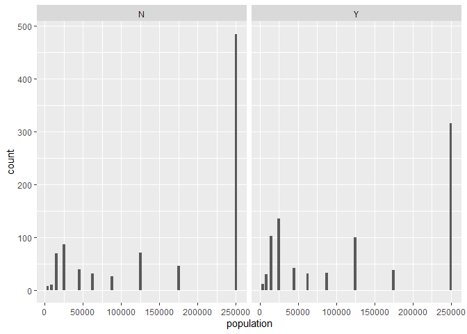

Chile Análisis de datos
================

# Análisis descriptivo datos Chile

Comenzaremos con el análisis descriptivo para los datos de “Chile” del
paquete “car” analizando cada una de las variables, y el dataframe en
general.Primero cargaremos las librerías que vamos a necesitar. El
objetivo mas adelante será la predicción de voto de las personas que en
la encuesta contestaron que estaban indecisos, o de los que no había
datos(NA).

Lo primero que haremos será cargar los paquetes que vamos a necesitar.

``` r
library(car)#para los datos de Chile
```

    ## Loading required package: carData

``` r
library(tidyverse)
```

    ## -- Attaching packages --------------------------------------- tidyverse 1.3.1 --

    ## v ggplot2 3.3.5     v purrr   0.3.4
    ## v tibble  3.1.4     v dplyr   1.0.7
    ## v tidyr   1.1.3     v stringr 1.4.0
    ## v readr   2.0.1     v forcats 0.5.1

    ## -- Conflicts ------------------------------------------ tidyverse_conflicts() --
    ## x dplyr::filter() masks stats::filter()
    ## x dplyr::lag()    masks stats::lag()
    ## x dplyr::recode() masks car::recode()
    ## x purrr::some()   masks car::some()

``` r
library(ggplot2)
library(RcmdrMisc)
```

    ## Loading required package: sandwich

``` r
library(hunspell)
library(caret)
```

    ## Loading required package: lattice

    ## 
    ## Attaching package: 'caret'

    ## The following object is masked from 'package:purrr':
    ## 
    ##     lift

Después cargaremos los datos, utilizamos data() para cargar los datos de
un paquete. Al ser Chile unos datos de una librería ?Chile nos mostrará
la descripción del dataset y las variables, veremos el nombre de las
variables y una pequeña descripción.

``` r
data(Chile)
```

Chile es un dataframe que tiene 2700 filas(2700 encuestados) y 8
columnas( cada encuestado ha dado información sobre 8 variables) de una
encuesta realizada en Chile en 1988 para una votación sobre Pinochet.

Una vez cargado los datos names() nos dira el nombre de las variables, y
class() que tipo de objeto es, en este caso un dataframe con las
variables region, population, sex, age, education, income, statusquo y
vote.

``` r
names(Chile)
```

    ## [1] "region"     "population" "sex"        "age"        "education" 
    ## [6] "income"     "statusquo"  "vote"

``` r
class(Chile)
```

    ## [1] "data.frame"

Cada variable puede ser distinta para saber que tipo de variable es
podemos hacer class() a la variable, si esta es factor podremos hacer
levels() para saber sus niveles.

Otra opción es hacer str() en lugar de class() lo que nos dará mas
detalles de la estructura de la variable directamente.

## Análisis univariante

Comenzamos ahora el análisis univariante, creo que lo mejor seria hacer
un summary() de cada una de las variables ya que este va a diferenciar
el análisis entre las variables según estas sean variables cuantitativas
o cualitariva.

### Región

Es un factor, una variable cualitativa que tiene los siguientes niveles
C(Central), M(area metropolitana de Santiago), N(Norte), S(Sur),
SA(ciudad de Santiago)

``` r
class(Chile$region)
```

    ## [1] "factor"

``` r
levels(Chile$region)
```

    ## [1] "C"  "M"  "N"  "S"  "SA"

Para región que es una variable categórica podemos ver las frecuencias
absolutas de sus niveles, vemos que el valor C se repite 600 veces el
valor M 100 el N 322 el S 718 y el SA 960.

Para ver las frecuencias relativas podemos hacer una tabla,table(), y
dividirla entre el número de columnas multiplicado por 100, esto nos
dará el porcentaje de cada uno de los niveles del factor.

``` r
summary(Chile$region)
```

    ##   C   M   N   S  SA 
    ## 600 100 322 718 960

``` r
table(Chile$region)/nrow(Chile)*100
```

    ## 
    ##         C         M         N         S        SA 
    ## 22.222222  3.703704 11.925926 26.592593 35.555556

Para visualizar esto podemos hacer un diagrama de barras. La función
plot() por defecto hace un diagrama de barras,

``` r
plot(Chile$region)
```

<!-- --> Para saber si la variable
contiene NA podemos meter la variable en la función is.na() esto nos
devolverá un vector lógico de TRUE y FALSE para cada valor de la
variable. La función any nos dirá si algún valor de ese vector es TRUE,
de ser así la función any nos devolverá TRUE de lo contrario nos
devolverá FALSE.

``` r
any(is.na(Chile$region))
```

    ## [1] FALSE

FALSE, la variable no tiene NA´s.

### Population

La siguiente variable es un integer, una variable cuantitativa que toma
números enteros, en principio una variable continua de la población de
la comunidad correspondiente. Vamos ha hacer un summary para ver sus
estadísticos descriptivos.

``` r
class(Chile$population)
```

    ## [1] "integer"

``` r
summary(Chile$population)
```

    ##    Min. 1st Qu.  Median    Mean 3rd Qu.    Max. 
    ##    3750   25000  175000  152222  250000  250000

La variable tiene de mínimo 3750 y max 250000, su media es 15222 el
primer cuartil 25000 y el tercero es 250000 igual que el máximo.

vamos a ver su histograma con la función hist() vemos como se
distribuye.

``` r
hist(Chile$population)
```

<!-- --> El histograma nos muestra que en
lugar de ser una variable continua son los mismos valores que se repiten
varias veces, es una variable discreta, vamos a hacer una tabla de
frecuencias.

``` r
table(Chile$population)/nrow(Chile)*100
```

    ## 
    ##       3750       8750      15000      25000      45000      62500      87500 
    ##  0.7407407  2.2222222 11.1111111 13.3333333  4.4444444  2.9629630  2.9629630 
    ##     125000     175000     250000 
    ##  8.8888889  5.1851852 48.1481481

En efecto, parece que no hay muchos valores, si metemos la tabla en la
función length() nos dara su longitud, es decir el numero de valores
distintos.

``` r
length(table(Chile$population))
```

    ## [1] 10

``` r
any(is.na(Chile$population))
```

    ## [1] FALSE

Parece que hay 10 valores que se repiten, esto se deberá a que se ha
preguntado en 10 comunidades y esa es la población que se repite, vemos
que la población con 250000 habitantes tiene hasta el 48% de los
encuestados(Conclusión extraída de la tabla). Si fuera necesario, esta
variable podría pasarse a categórica ya que solo tiene 10 registros
distintos.Parece que no hay NA´s.

Al ser una variable discreta podemos hacer mejor un gráfico de barras.
pero al ser una variable cuantitativa pasaremos la variable a factor con
as.factor()

``` r
plot(as.factor(Chile$population))
```

<!-- --> Podemos observar visualmente
ese 48% de los registros que se tomaron en la ciudad de 250000
habitantes. \#\#\# Sex Es un factor con los niveles F para femenino y M
para masculino

``` r
class(Chile$sex)
```

    ## [1] "factor"

``` r
levels(Chile$sex)
```

    ## [1] "F" "M"

``` r
summary(Chile$sex)
```

    ##    F    M 
    ## 1379 1321

Como es un factor vamos a hacer una tabla para ver las frecuencias
absolutas y relativas,

``` r
table(Chile$sex)
```

    ## 
    ##    F    M 
    ## 1379 1321

``` r
table(Chile$sex)/nrow(Chile)*100
```

    ## 
    ##        F        M 
    ## 51.07407 48.92593

``` r
any(is.na(Chile$sex))
```

    ## [1] FALSE

Hay 1379(51.07%) mujeres y 1321(48.92%) hombres el gráfico de barras
muostrará perfectamente el resultado. No hay NA´s.

``` r
plot(Chile$sex)
```

<!-- --> Representación visual de los
datos, hay un poco mas de registros de mujeres.

### Age

La edad en años es un integer, toma valores enteros con la edad de las
personas, sabemos que es una variable cuantitativa pero no si es
discreta o continua. Vamos a hacer un summary() para ver los
estadísticos descriptivos.

``` r
class(Chile$age)
```

    ## [1] "integer"

``` r
summary(Chile$age)
```

    ##    Min. 1st Qu.  Median    Mean 3rd Qu.    Max.    NA's 
    ##   18.00   26.00   36.00   38.55   49.00   70.00       1

El mínimo es 18(La mayoría de edad) y el máximo 70, el primer cuartil 26
y el tercero 49, la media es 38.55 y la mediana 36. Podemos ver que hay
un NA.

``` r
hist(Chile$age)
```

<!-- -->

``` r
length(table(Chile$age))
```

    ## [1] 53

Podemos observar como se distribuye en el histograma, en este caso
observaremos que no hay saltos, toma todos los valores entre 18 y 70. En
este caso podríamos complementar el análisis con un gráfico de cajas con
la función boxplot()

``` r
boxplot(Chile$age)
```

<!-- --> Podemos ver los cuartiles, el
recorrido intercuartilico y la mediana, parece que esta algo desviada
hacia los valores menores, la mitad de los registros están entre gente
de 18 y 36 años.

### Education

Factor con los niveles, P para educación primaria, PS para niveles de
educación post secundaria y S para niveles de educación secundaria.

``` r
class(Chile$education)
```

    ## [1] "factor"

``` r
levels(Chile$education)
```

    ## [1] "P"  "PS" "S"

``` r
summary(Chile$education)
```

    ##    P   PS    S NA's 
    ## 1107  462 1120   11

``` r
table(Chile$education)/nrow(Chile)*100
```

    ## 
    ##        P       PS        S 
    ## 41.00000 17.11111 41.48148

El valor que mas se repite es S 1120 veces(41.48%), seguido de P 1107
(41%) y de PS 462 (17.11%), también hay 11 NA´s.

Podemos ayudar a la visualización con un gráfico de barras.

``` r
plot(Chile$education)
```

<!-- --> \#\#\# Income Integer que es
una variable que toma valores enteros,es cuantitativa, en principio
parece una variable continua que expresa los ingresos mensuales en
pesos. Vamos a ver los estadísticos principales.

``` r
class(Chile$income)
```

    ## [1] "integer"

``` r
summary(Chile$income)
```

    ##    Min. 1st Qu.  Median    Mean 3rd Qu.    Max.    NA's 
    ##    2500    7500   15000   33876   35000  200000      98

Podemos mirar la longitud de la tabla de frecuencias para ver si
realmente es una variable continua, también podemos ver el histograma.
Hay 98 NA´s.

``` r
hist(Chile$income)
```

<!-- --> De nuevo es una variable que
parecia continua pero que realmente tiene 7 valores distintos.

``` r
length(table(Chile$income))
```

    ## [1] 7

Esto se debe a que en la encuesta debieron dar una horquilla de
ingresos.Podemos ver un gráfico de barras para ver los valores y su
frecuencia, pero al ser cuantitativa la función plot no nos hará un
gráfico de barras, por eso es mejor pasarlo a factor con la función as
factor.

``` r
plot(as.factor(Chile$income))
```

<!-- --> Hay siete tipos distintos de
ingresos(2500,7500,15000,35000,75000,125000,200,000), siguen
prácticamente una distribucion normal un poco desviada hacia valores
bajos.

``` r
table(Chile$income)/nrow(Chile)*100
```

    ## 
    ##      2500      7500     15000     35000     75000    125000    200000 
    ##  5.925926 18.296296 28.444444 27.666667  9.962963  3.259259  2.814815

Podemos ver que los ingresos que mas se repiten son 15000 con un28% y
35000 con un 27%.

### Statusquo

Escala de apoyo al status-quo, es una variable numeric, numérica, pero
no necesariamente números enteros que toma valores en función del apoyo
al status-quo. Podemos ver sus estadlísticos principales.

``` r
class(Chile$statusquo)
```

    ## [1] "numeric"

``` r
summary(Chile$statusquo)
```

    ##     Min.  1st Qu.   Median     Mean  3rd Qu.     Max.     NA's 
    ## -1.80301 -1.00223 -0.04558  0.00000  0.96857  2.04859       17

``` r
length(table(Chile$statusquo))
```

    ## [1] 2092

Bueno, esta variable ya no toma unos pocos valores, si no que tiene
hasta 2092 valores distintos, toma valores negativos con un mínimo de
1.80301 y un máximo de 2.04859 la media es 0 la mediana -0.04558 el
primer cuartil -1.00223 y el tercero 0.96857. Tiene 17 NA´s. Pata ver su
distribución podemos hacer un histograma.

``` r
hist(Chile$statusquo)
```

<!-- --> O un gráfico de cajas.

``` r
boxplot(Chile$statusquo)
```

<!-- --> Esta variable al ser continua
se puede ver los datos perfectamente en el gráfico boxplot los curtiles
y la media.

la media es 0 pero la mediana -0.04558 por eso aunque el valor medio sea
0 hay mas registros por debajo del 0 que por encima. \#\#\# Vote

Nuestra variable a predecir, es una variable factor según lo que van a
votar en relación a Pinochet, con los niveles A para abstención, N para
no(contra Pinochet), Y para si , U para indeciso.

``` r
class(Chile$vote)
```

    ## [1] "factor"

``` r
levels(Chile$vote)
```

    ## [1] "A" "N" "U" "Y"

``` r
summary(Chile$vote)
```

    ##    A    N    U    Y NA's 
    ##  187  889  588  868  168

``` r
table(Chile$vote)/nrow(Chile)*100
```

    ## 
    ##         A         N         U         Y 
    ##  6.925926 32.925926 21.777778 32.148148

El valor que mas se repite es N 889(32.92592%) el segundo Y
868(32.1481%) después U 588(21.7%) por último A 187(6.92%) y también hay
168 NA´s. esta distribución se puede ver perfectamente en el gráfico de
barras.

``` r
plot(Chile$vote)
```

<!-- -->

## Análisis bivariante

Una vez ya conocemos cada variable, si es factor, si no, si podría
convertirse a factor o si no, vamos a comenzar el análisis bivariante.

El objetivo es predecir lo que votarán los indecisos o aquellos que no
contestaron(NA) pero los que se abstendrán vote=A no nos sirven. Por eso
vamos a eliminarlos de nuestro dataset.

Por otro lado si queremos predecir a partir del resto de las variables
lo que votarán los que hayan contesrado U o sean NA´s, será importante
eliminar aquellos encuestados de los que no se tengán datos en las
variables predicadoras, es decir tengan NA´s en cualquier variable que
no sea vote.

Utilizaremos ahora lenguaje del paquete tidyverse, nomenclatura a través
de pipes que incluye como el primer elemento de una función aquel objeto
que esta a la izquierda de la tubería %&gt;%.

ademas utilizaremos drop\_na para eliminar los na de las 7 primeras
columnas.

``` r
nrow(Chile)
```

    ## [1] 2700

``` r
Chile<-Chile%>%drop_na(1:7)
nrow(Chile)
```

    ## [1] 2581

``` r
2700-nrow(Chile)
```

    ## [1] 119

``` r
any(is.na(Chile[1:7]))
```

    ## [1] FALSE

``` r
any(is.na(Chile[8]))
```

    ## [1] TRUE

Ahora tengo 2581 filas es decir, 2581 datos para cada variable, pero no
tengo NA´s salvo en la variable a predecir, he borrado 119 datos. solo
tengo NA´s en la variable a predecir

Tampoco tengo interés en la gente que se abstendrá ya que se me pide
predecir que votaran los que estan indecisos (“U”) y los que no hay
registro NA.

``` r
summary(Chile$vote)
```

    ##    A    N    U    Y NA's 
    ##  177  867  551  836  150

Tras haber quitado los NA del resto de variables hay 177 que contestaron
A en vote, voy a eliminarlos.

``` r
Chile<-Chile%>%filter(vote!="A"| is.na(vote))
summary(Chile$vote)
```

    ##    A    N    U    Y NA's 
    ##    0  867  551  836  150

``` r
nrow(Chile)
```

    ## [1] 2404

``` r
Chile$vote<-droplevels(Chile$vote)
summary(Chile$vote)
```

    ##    N    U    Y NA's 
    ##  867  551  836  150

Ahora tengo 2404 registros para cada variables, pero nadie que haya
contestado A, tambien hago un droplevels ya que no necesito el nivel A
nunca mas.

Me dispongo ahora si a relacionar variable a variable, como la variable
a predecir es vote, no tiene sentido para este problema relacionar por
ejemplo income con statusquo así que voy a relacionar cada variable con
vote.

### Región

Al ser dos variables cualitativas vamos a ver la tabla de frecuencia y
la de frecuencia relativas, para ver como se relaciona la región con el
voto

``` r
table (Chile[c("region","vote")])
```

    ##       vote
    ## region   N   U   Y
    ##     C  209 130 165
    ##     M   17  19  37
    ##     N   98  46 132
    ##     S  209 140 267
    ##     SA 334 216 235

``` r
prop.table (table (Chile[c("region","vote")]), "region")
```

    ##       vote
    ## region         N         U         Y
    ##     C  0.4146825 0.2579365 0.3273810
    ##     M  0.2328767 0.2602740 0.5068493
    ##     N  0.3550725 0.1666667 0.4782609
    ##     S  0.3392857 0.2272727 0.4334416
    ##     SA 0.4254777 0.2751592 0.2993631

Según la región hay entre un 16% y un 27,5% de indecisos, pero para ver
si la region puede tener que ver con votar Y o N vamos a quitarlos.

``` r
prop.table (table (Chile[Chile$vote!="U",c("region","vote")]), "region")
```

    ##       vote
    ## region         N         U         Y
    ##     C  0.5588235 0.0000000 0.4411765
    ##     M  0.3148148 0.0000000 0.6851852
    ##     N  0.4260870 0.0000000 0.5739130
    ##     S  0.4390756 0.0000000 0.5609244
    ##     SA 0.5869947 0.0000000 0.4130053

El porcentaje de los que votan si cambia del 41% al 68% según la región,
podemos hacer un contraste chi-cuadrado, la hipótesis nulas seria la
independencia de los factores, podemos excluir U.

``` r
ChileYN<-Chile %>% filter(Chile$vote!="U") 
ChileYN$vote<-droplevels(ChileYN$vote)
table1<-xtabs(~region+vote,data=ChileYN)
chisq.test(table1)
```

    ## 
    ##  Pearson's Chi-squared test
    ## 
    ## data:  table1
    ## X-squared = 41.352, df = 4, p-value = 2.273e-08

El p-valor es &lt;0.05 rechazo la Ho de independencia,sin embargo vamos
a mirar la tabla.

``` r
table1
```

    ##       vote
    ## region   N   Y
    ##     C  209 165
    ##     M   17  37
    ##     N   98 132
    ##     S  209 267
    ##     SA 334 235

Para la región M hay mas del doble que votan Y que N pero solo hay 17 y
37 registros, eso puede alterar el test

En problemas así visualizar puede ayudar, al tratarse de 2 variables
cualitativas erigiré el stack bar chart o gráfico de barras apiladas, y
tras observarlo parece que no hay nada concluyente, puede que sea cierto
que en algunas regiones se tienda mas a un voto u a otro, pero no me
parece algo a través de lo cual yo haria una predicción.

``` r
ggplot(ChileYN, aes(x = region)) + 
  geom_bar(position = "stack")+
    facet_wrap(~vote)
```

<!-- --> \#\#\# Population Population es
una variable cuantitativa discreta por lo que su análisis podria hacerse
de manera parecida a un análisis de dos variables cualitativas.

``` r
table (ChileYN[c("population","vote")])
```

    ##           vote
    ## population   N   Y
    ##     3750     7  11
    ##     8750    10  30
    ##     15000   69 102
    ##     25000   86 135
    ##     45000   39  41
    ##     62500   31  31
    ##     87500   26  33
    ##     125000  70 100
    ##     175000  45  38
    ##     250000 484 315

``` r
prop.table (table (ChileYN[c("population","vote")]), "population")
```

    ##           vote
    ## population         N         Y
    ##     3750   0.3888889 0.6111111
    ##     8750   0.2500000 0.7500000
    ##     15000  0.4035088 0.5964912
    ##     25000  0.3891403 0.6108597
    ##     45000  0.4875000 0.5125000
    ##     62500  0.5000000 0.5000000
    ##     87500  0.4406780 0.5593220
    ##     125000 0.4117647 0.5882353
    ##     175000 0.5421687 0.4578313
    ##     250000 0.6057572 0.3942428

Por ejemplo en la ciudad de 3750 habitantes el 61% votaran que si y en
la de 8750 el 75% sin embargo en las ciudades grandes se tiende mas al
no, en la de 250000 hab es un 60% el no.

Vamos a visualizarlo

``` r
ggplot(ChileYN, aes(x = population)) + 
  geom_bar(position = "stack")+
    facet_wrap(~vote)
```

<!-- --> Las conclusiones que saco es
que parece que sigue el mismo patrón, seguramente si paso las variable
población a factor y hago el test de independencia concluya que no son
independientes, pero no creo que sea una variable que se utilice para
predecir.

``` r
table2<-xtabs(~as.factor(population)+vote,data=ChileYN)
chisq.test(table2)
```

    ## 
    ##  Pearson's Chi-squared test
    ## 
    ## data:  table2
    ## X-squared = 70.091, df = 9, p-value = 1.461e-11

En efecto rechazo que las variables sean independientes, porque si hay
relación pero puede que no sea la mejor variable para la predicción.

### Sex

Estamos de nuevo ante dos variables categóricas, vamos a hacer las
tablas de frecuencia absoluta y relativa

``` r
table (ChileYN[c("sex","vote")])
```

    ##    vote
    ## sex   N   Y
    ##   F 355 459
    ##   M 512 377

``` r
prop.table (table (ChileYN[c("sex","vote")]), "sex")
```

    ##    vote
    ## sex         N         Y
    ##   F 0.4361179 0.5638821
    ##   M 0.5759280 0.4240720

Parece observarse que los hombres son mas partidarios del N y las
mujeres de Y vamos a visualizarlo

``` r
ggplot(ChileYN, aes(x = sex)) + 
  geom_bar(position = "stack")+
    facet_wrap(~vote)
```

<!-- --> Los hombres tienden mas al No y
las mujeres mas al Sí seguro que no son variables independientes, pero
hasta cuanto me ayudará a la predicción.

``` r
table3<-xtabs(~sex+vote,data=ChileYN)
chisq.test(table3)
```

    ## 
    ##  Pearson's Chi-squared test with Yates' continuity correction
    ## 
    ## data:  table3
    ## X-squared = 32.678, df = 1, p-value = 1.088e-08

En efecto, las variables no son independientes. \#\#\# Age Vamos con
nuestra primera variable cuantitiativa continua, en casos de tener una
variable cuantitativa y una cualitativa podemos empezar por representar
un gráfico boxplot.

``` r
boxplot (age ~ vote, ChileYN)
```

<!-- --> Pude observarse que los jovenes
tienden mas al no y los mayores mas al Si, además entre los jovenes hay
menos dispersion, el recorrido intercuartilico es menor, entre los
mayores hay mas dispersión. Pero tampoco parece ser algo muy
determinante. Si hago unas gráficas de densidad de kernel agrupadas
puedo ver como no parece muy determinante la edad.

``` r
ggplot(ChileYN, aes(x = age)) +
  geom_density(alpha = 0.4) +
  labs(title = "Voto según edad")+
    facet_wrap(~vote)
```

<!-- --> No parece que sea algo muy
determinante, pero si que se observa una tendencia de los jovenes hacia
el no y de los adultos hacia el si. Podemos hacer un numSummary() de la
edad agrupada en función del voto para ver su media su desviación tipica
y otros estadísticos descriptivos

``` r
numSummary(ChileYN$age,groups=ChileYN$vote)
```

    ##       mean       sd IQR 0% 25% 50% 75% 100% data:n
    ## N 35.99885 14.32786  22 18  23  34  45   70    867
    ## Y 40.20335 15.15056  25 18  27  38  52   70    836

También podemos hacer un test t-student para contrastar la Ho de
igualdad de medias.

``` r
t.test(age~vote, alternative='two.sided', conf.level=.95, var.equal=FALSE, 
  data=ChileYN)
```

    ## 
    ##  Welch Two Sample t-test
    ## 
    ## data:  age by vote
    ## t = -5.8797, df = 1686.7, p-value = 4.944e-09
    ## alternative hypothesis: true difference in means between group N and group Y is not equal to 0
    ## 95 percent confidence interval:
    ##  -5.607052 -2.801954
    ## sample estimates:
    ## mean in group N mean in group Y 
    ##        35.99885        40.20335

el p valor &lt; 0.05 por lo que rechazo la Ho de igualdad de medias,
esto significa que la media de edad según el voto es distinta por lo que
las variables estan relacionadas. Pero no se hasta cuando me ayudará a
predecir.

### Education

Otra vez dos variables cualitativas, vamos a seguir el mismo
procedimiento.

``` r
table (ChileYN[c("education","vote")])
```

    ##          vote
    ## education   N   Y
    ##        P  262 409
    ##        PS 220 123
    ##        S  385 304

``` r
prop.table (table (ChileYN[c("education","vote")]), "education")
```

    ##          vote
    ## education         N         Y
    ##        P  0.3904620 0.6095380
    ##        PS 0.6413994 0.3586006
    ##        S  0.5587808 0.4412192

Puede parecer que hay una tendencia, que la gente con educación
secundaria y postsecundaria tiende mucho mas a el NO mientras que los de
educción primaria tienden al Si. Vamos a visualizar los datos.

``` r
ggplot(ChileYN, aes(x = education)) + 
  geom_bar(position = "stack")+
    facet_wrap(~vote)
```

<!-- --> En efecto parece que se cumple
esa tendencia, pero podemos hacer un contraste chi cuadrado para
comprobarlo

``` r
table3<-xtabs(~education+vote,data=ChileYN)
chisq.test(table3)
```

    ## 
    ##  Pearson's Chi-squared test
    ## 
    ## data:  table3
    ## X-squared = 68.617, df = 2, p-value = 1.259e-15

p valor &lt; 0.05 rechazo la Ho de que las variabels son independientes
por lo que tienen relación. \#\#\# Income Income es una variable que
parecia continua pero es discreta. Se podría convertir a factor

``` r
table (ChileYN[c("income","vote")])
```

    ##         vote
    ## income     N   Y
    ##   2500    46  55
    ##   7500   143 158
    ##   15000  244 238
    ##   35000  269 228
    ##   75000   98  91
    ##   125000  38  31
    ##   200000  29  35

``` r
prop.table (table (ChileYN[c("income","vote")]), "income")
```

    ##         vote
    ## income           N         Y
    ##   2500   0.4554455 0.5445545
    ##   7500   0.4750831 0.5249169
    ##   15000  0.5062241 0.4937759
    ##   35000  0.5412475 0.4587525
    ##   75000  0.5185185 0.4814815
    ##   125000 0.5507246 0.4492754
    ##   200000 0.4531250 0.5468750

Al hacer la tabla de frecuencia se observa que el N y el Y estan entre
el 45% y el 55% para todos los niveles de ingresos, vamos a
representarlo.

``` r
ggplot(ChileYN, aes(x = income)) + 
  geom_bar(position = "stack")+
    facet_wrap(~vote)
```

<!-- --> Aunque parece seguir el mismo
patrón este gráfico no me parece muy bueno. vamos a pasar income a
factor y hacer un test chi cuadrado

``` r
table4<-xtabs(~as.factor(income)+vote,data=ChileYN)
chisq.test(table4)
```

    ## 
    ##  Pearson's Chi-squared test
    ## 
    ## data:  table4
    ## X-squared = 5.9761, df = 6, p-value = 0.4259

El p valor es &gt; que 0.05 no rechazo la Ho nula de que las variables
son independientes, es decir, que posiblemente sea la variable que menos
me ayude a estimar.

Otra opción con dos variables categóricas(al pasar income a factor
podriamos observarla como categórica, con 7 grupos de ingresos
distintos) es hacer gráficos de mosaico.

``` r
vcd::mosaic(table4, main = "Ingresos en función del voto")
```

<!-- --> Podemos contrastar lo que ya
nos dijo el test Chi-cuadrado, al ser del mismo tamaño los cuadros
significa que hay prácticamente el mismo tamaño de población que vota Y
con un ingreso determinado al que vota N.

### Statusquo

Tenemos ahora una variabe continua contra una categórica, vamos a ver
los estadísticos descriptivos agrupados.

``` r
numSummary(ChileYN$statusquo,groups=ChileYN$vote)
```

    ##         mean        sd       IQR       0%        25%      50%       75%    100%
    ## N -0.9137250 0.4817630 0.4935150 -1.72594 -1.2579500 -1.07812 -0.764435 1.51284
    ## Y  0.9380941 0.6406205 0.8409025 -1.30351  0.5911275  1.17458  1.432030 1.71355
    ##   data:n
    ## N    867
    ## Y    836

Se observa una diferencia enorme, la media de los que votan N es de
-0.91 mientras la de los que votan Y es de 0.93

En estos casos conviene empezar con un gráfico boxplot para apreciar la
diferencia.

``` r
boxplot (statusquo ~ vote, ChileYN)
```

<!-- --> Este gráfico me parece muy
relevante, los que votan no suelen tener poco statusquo salvo algunos
outlier, los que votan si un statusquo muy elevado salvo algunos
outlier, y los indecisos tienen un statusquo que se situa en la
media.voy a hacer unas gráficas de densidad de kernel agrupadas.

``` r
graficopredicion<-ggplot(ChileYN, aes(x = statusquo)) +
  geom_density(alpha = 0.4) +
  labs(title = "Voto según statusquo")+
    facet_wrap(~vote);graficopredicion
```

<!-- --> Parece evidente, a mayor
statusquo mayor probabilidad de votar si y a menor statusquo mayor
probabilidad de votar no. Vamos hacer un test T de student para
contrastar la H0 de igualdad de medias.

``` r
t.test(statusquo~vote, alternative='two.sided', conf.level=.95, var.equal=FALSE, 
  data=ChileYN)
```

    ## 
    ##  Welch Two Sample t-test
    ## 
    ## data:  statusquo by vote
    ## t = -67.234, df = 1549.7, p-value < 2.2e-16
    ## alternative hypothesis: true difference in means between group N and group Y is not equal to 0
    ## 95 percent confidence interval:
    ##  -1.905844 -1.797794
    ## sample estimates:
    ## mean in group N mean in group Y 
    ##      -0.9137250       0.9380941

P valor &lt; 0.05 rechazo H0 de igualdad de medias, las variables no son
independientes, algo que parecia evidente tras su visualización. El
statusquo es la variable que mejor me clasificará el voto con los datos
observados

## Conclusiones

Parece ser que el status-quo es lo mas relevante, así que predecirla los
votos faltan tes en función del statusquo, los que no pueda predecir por
el statusquo deberé predecirlos según la educación o el sexo que eran
las otras variables relevantes.

Podemos hacer un modelo muy simple, una regresión logistica(logic) ya
que tenemos una variable a predecir cualitativa y variables predicadoras
cualitativas y cuantitativas.

``` r
modelologit<- glm(vote ~ statusquo + sex + region + population + income + education + age, family=binomial(logit), data=ChileYN)
summary(modelologit)
```

    ## 
    ## Call:
    ## glm(formula = vote ~ statusquo + sex + region + population + 
    ##     income + education + age, family = binomial(logit), data = ChileYN)
    ## 
    ## Deviance Residuals: 
    ##     Min       1Q   Median       3Q      Max  
    ## -3.2009  -0.2753  -0.1344   0.2031   2.8616  
    ## 
    ## Coefficients:
    ##               Estimate Std. Error z value Pr(>|z|)    
    ## (Intercept)  1.046e+00  4.592e-01   2.279  0.02269 *  
    ## statusquo    3.229e+00  1.524e-01  21.184  < 2e-16 ***
    ## sexM        -5.515e-01  2.041e-01  -2.702  0.00689 ** 
    ## regionM      7.072e-01  6.023e-01   1.174  0.24030    
    ## regionN     -9.958e-02  3.587e-01  -0.278  0.78134    
    ## regionS     -3.044e-01  2.928e-01  -1.040  0.29847    
    ## regionSA    -3.012e-01  3.404e-01  -0.885  0.37619    
    ## population   1.276e-06  1.414e-06   0.902  0.36714    
    ## income      -2.972e-06  2.856e-06  -1.041  0.29807    
    ## educationPS -9.676e-01  3.461e-01  -2.795  0.00518 ** 
    ## educationS  -6.575e-01  2.440e-01  -2.695  0.00705 ** 
    ## age          7.108e-04  7.472e-03   0.095  0.92422    
    ## ---
    ## Signif. codes:  0 '***' 0.001 '**' 0.01 '*' 0.05 '.' 0.1 ' ' 1
    ## 
    ## (Dispersion parameter for binomial family taken to be 1)
    ## 
    ##     Null deviance: 2360.29  on 1702  degrees of freedom
    ## Residual deviance:  703.48  on 1691  degrees of freedom
    ## AIC: 727.48
    ## 
    ## Number of Fisher Scoring iterations: 6

Si hacemos un resumen de modelo podemos ver que las únicas variables que
considera significativas son el statusquo el sexo y la educación, lo que
concuerda con la información que nosotros percibimos en el análisis
descriptivo.

## Predicciones

Con las conclusiones obtenidas y debido a la naturaleza del problema(
predecir variable categóricas con variables continuas y categóricas) se
podría predecir de diversas maneras, con el mismo logit, con algoritmos
de arboles de decisión maquinas vector soporte etc..

Podríamos imputar los datos según nuestro análisis descriptivo para
seguir con la linea del trabajo. Vamos a volver a ver el gráfico de
statusquo

``` r
graficopredicion
```

<!-- -->

Podemos ver que las personas que votan si con un statusquo&lt;0 son casi
nulas.

``` r
length(which(ChileYN$vote=="N" & ChileYN$statusquo<=-0))/length(which(ChileYN$statusquo<=-0))*100
```

    ## [1] 91.17318

De hecho el 91% de las personas con un statusquo menor que 0 votan N,
podemos por tanto imputar N a las personas que contestaron U o que
tienen NA pero su statusquo es menor que 0.

``` r
summary(Chile$vote)
```

    ##    N    U    Y NA's 
    ##  867  551  836  150

``` r
Chile %>% filter(vote!="Y" & vote!="N" | is.na(vote)) %>% nrow()
```

    ## [1] 701

Hay 701 filas a imputar los datos entre U y NA, de esos hay que ver los
que tengan statusquo menor que 0 para imputarles el voto N

``` r
Chile %>% filter(vote!="Y" & vote!="N" | is.na(vote),statusquo < 0) %>% nrow()
```

    ## [1] 323

``` r
Chile %>% filter(vote!="Y" & vote!="N" | is.na(vote),statusquo > 0) %>% nrow()
```

    ## [1] 378

``` r
Chile %>% filter(vote!="Y" & vote!="N" | is.na(vote),statusquo == 0) %>% nrow()
```

    ## [1] 0

323 tienen el statusquo menor que 0 y 378 mayor que 0, ninguno es
exactamente 0. Vamos a haer los dos indices para imputar los Y y los N.

``` r
filasN <- Chile %>% filter(vote!="Y" & vote!="N" | is.na(vote),statusquo < 0) %>% rownames()
Chile[filasN,"vote"]<- "N"
filasY <- Chile %>% filter(vote!="Y" & vote!="N" | is.na(vote),statusquo > 0) %>% rownames()
Chile[filasY,"vote"]<- "Y"
```

Vamos a ver como queda la variable vote

``` r
summary(Chile$vote)
```

    ##    N    U    Y 
    ## 1190    0 1214

``` r
Chiledescriptivo<-Chile
Chiledescriptivo<-droplevels(Chiledescriptivo)
```

1190 N y 1214 Y, según nuestras predicciones este sería el resultado.

Podriamos comparar ahora nuestro resultado con el obtenido por el
algoritmo CART(Clasification and regresion Tree algorithm, rpart en
caret) para ello deberemos preparar los datos de nuevo.

``` r
data(Chile)
Chile<-Chile%>%drop_na(1:7)
Chile<-Chile%>%filter(vote!="A"| is.na(vote))
Chile$vote<-droplevels(Chile$vote)
```

En estos casos habria que mirar si los datos estan balanceados, pero
solo debemos fijarnos en los que votan Y o N

``` r
ChileYN2<-Chile %>% filter(Chile$vote!="U")
table(ChileYN2$vote=="Y")/nrow(ChileYN2) * 100
```

    ## 
    ##    FALSE     TRUE 
    ## 50.91016 49.08984

``` r
ChileYN2<-droplevels(ChileYN2)
```

Vemos que los datos estan perfectamente balanceados. Despues haremos una
particion de los datos manteniendo esa estructura.

``` r
inTrain <- createDataPartition(
  y = ChileYN2$vote,
  p = .75, #porcentaje en el train
  list = FALSE #Devolver en formato vector. 
)
training <- ChileYN2[inTrain,];nrow(training)#1278
```

    ## [1] 1278

``` r
testing <- ChileYN2[-inTrain,];nrow(testing)#425
```

    ## [1] 425

Ahora vamos a entrenar el podelo para predecir.

``` r
rpartmodel <- train(
  vote ~ .,
  data = training, 
  method = "rpart",
)
predict1<-predict(rpartmodel,newdata = testing)
```

Vamos a ver la matriz de confusión

``` r
cf1<-confusionMatrix(data=predict1,reference=testing$vote)
cf1
```

    ## Confusion Matrix and Statistics
    ## 
    ##           Reference
    ## Prediction   N   Y
    ##          N 200  18
    ##          Y  16 191
    ##                                        
    ##                Accuracy : 0.92         
    ##                  95% CI : (0.89, 0.944)
    ##     No Information Rate : 0.5082       
    ##     P-Value [Acc > NIR] : <2e-16       
    ##                                        
    ##                   Kappa : 0.8399       
    ##                                        
    ##  Mcnemar's Test P-Value : 0.8638       
    ##                                        
    ##             Sensitivity : 0.9259       
    ##             Specificity : 0.9139       
    ##          Pos Pred Value : 0.9174       
    ##          Neg Pred Value : 0.9227       
    ##              Prevalence : 0.5082       
    ##          Detection Rate : 0.4706       
    ##    Detection Prevalence : 0.5129       
    ##       Balanced Accuracy : 0.9199       
    ##                                        
    ##        'Positive' Class : N            
    ## 

Tiene un accuracy de 0.91, al igual que nosotros cuando imputamos a
partir de un statusquo &lt; 0(Cuando los datos estan balanceados el
accuracy), tambien es interesnte observar la matriz de confusión.

``` r
cf1$table
```

    ##           Reference
    ## Prediction   N   Y
    ##          N 200  18
    ##          Y  16 191

Tengo 12 falsos positivos y 26 falsos negativos. Vamos a ver como
funciona el arbol.

``` r
rattle::fancyRpartPlot(rpartmodel$finalModel)
```

<!-- --> Funciona muy parecido a nuestro
análisis descriptivo pero en lugar de elegir el valor 0 elige el 0.022.

Vamos a aplicar este modelo a los datos de Chile, en lugar solo a los de
test, paara ello dividiremos los datos de Chile en función de los que
tenemos que predecir y los que no

``` r
Chile1<-Chile %>% filter(vote!="Y" & vote!="N" | is.na(vote))
Chile2<- Chile %>% filter(vote== "Y" | vote=="N")
```

Chile 1 son los datos que vamos a predecir

``` r
Chile1$vote<-predict(rpartmodel,newdata =Chile1)
Chile1
```

    ##      region population sex age education income statusquo vote
    ## 9         N     175000   F  41         P  15000  -1.01292    N
    ## 12        N     175000   M  19         S  35000   1.02791    Y
    ## 15        N     175000   M  36        PS  35000   1.49026    Y
    ## 18        N     175000   M  30         S  35000  -0.90689    N
    ## 20        N     175000   F  50         S   2500  -1.05805    N
    ## 26        N     175000   F  28         S  35000   0.55328    Y
    ## 33        N     175000   M  36        PS   7500   0.15489    Y
    ## 46        N     125000   F  21         S   7500   0.53177    Y
    ## 53        N     125000   M  66         P  35000   0.87984    Y
    ## 57        N     125000   M  18         S  35000  -0.37211    N
    ## 63        N     125000   F  24         S  35000  -0.48981    N
    ## 65        N     125000   M  50         P  15000  -0.83203    N
    ## 67        N     125000   F  54         P  15000   0.90506    Y
    ## 75        N     125000   M  38        PS  75000   0.27293    Y
    ## 81        N     125000   M  38         S  15000  -0.59145    N
    ## 87        N     125000   F  19         S   7500  -0.14772    Y
    ## 88        N     125000   F  54         P   7500   0.22433    Y
    ## 90        N     125000   M  68         P   7500   0.11359    Y
    ## 97        N     125000   F  38         P  15000   0.28099    Y
    ## 98        N     125000   F  34         P   2500   0.10807    Y
    ## 103       N     250000   M  19        PS  15000   0.67533    Y
    ## 104       N     250000   M  58         P  15000   1.27496    Y
    ## 111       N     250000   M  66         P  15000  -0.70463    N
    ## 112       N     250000   F  31         S   7500   0.00744    Y
    ## 117       N     250000   M  41        PS  35000   0.25602    Y
    ## 118       N     250000   M  49         S  35000  -0.30605    N
    ## 128       N     250000   M  29         S  75000   0.09897    Y
    ## 139       N     250000   F  37         S  35000  -0.46709    N
    ## 176       N      87500   F  28         P  15000   1.19006    Y
    ## 182       N      45000   F  45         P  15000   0.83473    Y
    ## 185       N      45000   M  70         P  75000   0.01309    N
    ## 186       N      45000   M  46         P  35000   1.56214    Y
    ## 187       N      45000   F  63         P   7500  -0.78362    N
    ## 203       N       3750   F  61         S  15000   1.44401    Y
    ## 221       N     125000   F  58        PS  35000  -0.82454    N
    ## 224       N     125000   M  64         P  15000   1.33246    Y
    ## 226       N     125000   F  59         P   7500   0.15020    Y
    ## 227       N     125000   M  28        PS   7500  -0.76181    N
    ## 228       N     125000   F  37         S  15000  -0.64763    N
    ## 230       N     125000   F  51         S   7500  -0.78943    N
    ## 251       N     125000   M  48         P  15000  -1.14049    N
    ## 253       N     125000   F  49         P  35000   0.61995    Y
    ## 264       N      15000   F  37         P  15000  -0.33039    Y
    ## 266       N      15000   M  53         P  15000  -1.03452    N
    ## 272       N      15000   M  66         P  15000  -0.53327    N
    ## 273       N      15000   M  27         P   7500  -1.29617    N
    ## 274       N      15000   F  50         P  35000  -0.82904    N
    ## 284       N      87500   M  19         P   7500   0.90496    Y
    ## 293       N      87500   F  30         P   7500  -1.11878    N
    ## 295       N      87500   F  48         P   7500  -1.23032    N
    ## 301       N      25000   M  24         S  75000  -1.26552    N
    ## 302       N      25000   F  37         P  15000   1.17633    Y
    ## 310       N      25000   F  35        PS  35000  -0.81863    N
    ## 312       N      25000   F  49         P  15000  -1.27270    N
    ## 321       C      25000   F  44         P   7500  -0.96154    N
    ## 325       C      25000   M  45         P  15000   1.08003    Y
    ## 326       C      25000   F  45         P  15000   0.32158    Y
    ## 337       C      25000   F  36         P  15000  -0.36391    Y
    ## 339       C      25000   M  35         P  35000   0.08007    Y
    ## 351       C      45000   F  18         S  35000  -0.31489    N
    ## 358       C      45000   F  42         S 200000   0.99498    Y
    ## 369       C      62500   F  55         P   7500  -1.10678    N
    ## 384       C      15000   F  52         P   7500  -0.72812    N
    ## 389       C      15000   F  47         P   7500   0.15506    Y
    ## 391       C      15000   F  33         S  35000   0.45262    Y
    ## 392       C      15000   M  49         P  15000   0.18113    Y
    ## 394       C      15000   M  28         P  15000  -0.36182    Y
    ## 396       C      15000   F  38         S  35000   0.59831    Y
    ## 397       C      15000   F  27         P  15000  -1.12193    N
    ## 398       C      15000   M  26         P  35000   1.19153    Y
    ## 401       C      15000   M  27         S  35000   0.61180    Y
    ## 402       C      15000   M  46         P  35000   0.00078    N
    ## 409       C      15000   F  23        PS 125000   0.30914    Y
    ## 412       C      15000   M  70         P   7500  -0.98450    N
    ## 414       C      15000   F  33         S   7500   0.11608    Y
    ## 416       C      15000   M  38         P   7500  -0.59124    N
    ## 417       C      15000   M  30         P   2500   1.13733    Y
    ## 419       C      15000   F  33         P  15000  -0.27875    Y
    ## 420       C      15000   F  64         P   2500  -1.09626    N
    ## 422       C     250000   F  40         S  75000   1.05576    Y
    ## 425       C     250000   F  43         S  75000  -1.10254    N
    ## 434       C     250000   F  19         S  15000  -0.18302    Y
    ## 437       C     250000   F  48         S   7500   0.29811    Y
    ## 439       C     250000   F  70         S  35000  -1.03066    N
    ## 445       C     250000   F  29         P   7500   0.11608    Y
    ## 447       C     250000   F  38         S   7500   0.29811    Y
    ## 449       C     250000   F  41         S   2500  -1.27556    N
    ## 452       C     250000   F  29         S  15000   0.31346    Y
    ## 463       C     250000   M  30         P   7500   1.19250    Y
    ## 465       C     250000   F  69         S  75000   0.73645    Y
    ## 481       C     250000   M  25         S   7500   0.04881    Y
    ## 482       C     250000   F  31         P  35000   0.54258    Y
    ## 483       C     250000   F  42         S  35000   1.23905    Y
    ## 484       C     250000   F  27         S  35000   0.58567    Y
    ## 490       C     250000   M  20         S  75000  -0.98357    N
    ## 492       C     250000   F  65         P  35000   0.04406    Y
    ## 497       C     250000   F  57         P  35000  -1.01690    N
    ## 522       C     250000   F  70         S  35000  -0.13432    N
    ## 526       C     250000   M  28         S  15000  -0.32557    Y
    ## 530       C     250000   M  20        PS  75000  -0.12758    N
    ## 531       C     250000   M  52         S  15000   0.29255    Y
    ## 540       C     250000   F  36         P  15000  -1.29617    N
    ## 541       C       8750   F  27         S   7500   0.35050    Y
    ## 543       C       8750   M  25         S  35000  -0.97880    N
    ## 546       C       8750   M  39         P   2500  -0.86279    N
    ## 547       C       8750   M  70         P   7500   0.35125    Y
    ## 550       C       8750   F  40         P   2500   1.22060    Y
    ## 557       C       8750   M  61         P  75000   0.08005    Y
    ## 560       C       8750   M  36        PS  35000   0.18951    Y
    ## 570       C     125000   F  19         S  75000   1.01503    Y
    ## 572       C     125000   F  20         P  15000   1.13325    Y
    ## 575       C     125000   F  65         P   7500  -1.28897    N
    ## 592       C      62500   M  19         S   7500  -1.26325    N
    ## 594       C      62500   F  40         P   7500  -1.09176    N
    ## 599       C      62500   M  26         P  15000   0.85118    Y
    ## 606       C     175000   F  30         P  15000  -0.26213    Y
    ## 607       C     175000   M  30         S  35000   0.75432    Y
    ## 615       C     175000   M  48         S  75000   0.73356    Y
    ## 616       C     175000   F  55         P   2500   1.46184    Y
    ## 620       C     175000   M  49         P  15000  -0.13599    Y
    ## 624       C     175000   F  37         P   7500  -1.29617    N
    ## 632       C     175000   M  31        PS 125000   0.14096    Y
    ## 633       C     175000   F  36         S  35000   0.92806    Y
    ## 634       C     175000   F  39         S  75000   0.51058    Y
    ## 635       C     175000   M  44         S   2500   0.47079    Y
    ## 638       C     175000   F  50         P  15000  -0.93468    N
    ## 643       C      15000   M  25         P  15000  -0.27405    Y
    ## 653       C      15000   M  57         S  75000  -0.29196    N
    ## 657       C      15000   F  59         P  35000   0.49301    Y
    ## 663       C      15000   F  27         S  35000   1.32855    Y
    ## 664       C      15000   M  38         S  35000   1.58770    Y
    ## 665       C      15000   F  45         P   7500   1.39186    Y
    ## 668       C      15000   F  67         P  15000   0.94646    Y
    ## 669       C      15000   M  61         P  15000   0.56632    Y
    ## 676       C      15000   F  20         S   7500   0.61719    Y
    ## 678       C      15000   F  43         P   7500   1.08466    Y
    ## 679       C      15000   M  26         P  15000  -0.24317    Y
    ## 682       C      15000   F  44         P   2500   0.41004    Y
    ## 683       C      15000   M  55         P  15000   0.32051    Y
    ## 686       C      15000   M  64         P   7500   1.33395    Y
    ## 689       C      15000   F  21         S   7500   0.40932    Y
    ## 697       C      15000   F  60         P  35000  -0.92728    N
    ## 699       C      15000   M  23         S   7500   0.12472    Y
    ## 701       C      45000   F  35         P   7500   1.25841    Y
    ## 702       C      45000   M  54         P   7500   0.80784    Y
    ## 704       C      45000   M  22         S  15000   1.00996    Y
    ## 705       C      45000   M  28         S   7500   0.42771    Y
    ## 707       C      45000   F  29         S   7500  -0.70096    N
    ## 708       C      45000   F  30         P   7500   0.97000    Y
    ## 711       C      45000   F  42         P  35000   0.19210    Y
    ## 713       C      45000   M  66         P  15000   1.29875    Y
    ## 720       C      45000   F  57         S  15000  -1.29617    N
    ## 721       C      25000   F  49         P   7500  -0.61200    N
    ## 723       C      25000   F  37         S  35000   0.63836    Y
    ## 727       C      25000   F  37         S  35000   0.16682    Y
    ## 730       C      25000   M  31         S  75000   0.16466    Y
    ## 731       C      25000   F  29         S  35000   0.03032    Y
    ## 736       C      25000   F  47        PS  15000  -0.67532    N
    ## 739       C      25000   M  50         S  35000   0.24274    Y
    ## 741       C      87500   F  19         S   7500  -0.96542    N
    ## 743       C      87500   M  64         P   7500   0.60565    Y
    ## 745       C      87500   F  60         P  15000   0.13270    Y
    ## 752       C      87500   F  23         P  15000  -0.52933    N
    ## 753       C      87500   F  35        PS  75000  -1.26652    N
    ## 759       C      87500   M  42         P  15000   0.27852    Y
    ## 760       C      87500   M  44         P  15000  -1.01069    N
    ## 762       C     175000   M  28         P  15000   0.59039    Y
    ## 765       C     175000   F  19         S   7500   0.13374    Y
    ## 766       C     175000   F  28         S   7500  -1.11442    N
    ## 770       C     175000   F  44         S   7500  -1.15622    N
    ## 772       C     175000   F  40        PS  75000   0.79492    Y
    ## 789       C     175000   M  54         S  35000   1.21952    Y
    ## 795       C     175000   M  40         P  35000   0.78439    Y
    ## 798       C     175000   M  39         P   7500   0.42314    Y
    ## 800       C     175000   M  25         S 125000   1.08773    Y
    ## 802       C     175000   F  47         P  15000  -0.32176    Y
    ## 805       C     175000   M  52         P  15000   1.22444    Y
    ## 810       C     175000   M  30         S  15000  -0.61942    N
    ## 814       C     175000   M  37        PS  35000  -0.47005    N
    ## 816       C     175000   F  25         S  15000  -0.97034    N
    ## 817       C     175000   F  58         P   7500   0.06874    Y
    ## 820       C     175000   M  40         P  15000  -0.08067    Y
    ## 821       C      25000   F  29         P   7500  -0.78136    N
    ## 822       C      25000   F  54         P   7500   0.26943    Y
    ## 823       C      25000   M  33         P  15000   1.17576    Y
    ## 827       C      25000   F  29         S  15000  -0.39404    N
    ## 831       C      25000   M  25         P   7500  -1.14489    N
    ## 833       C      25000   F  34         S  15000  -0.92196    N
    ## 837       C      25000   F  30         P   7500   0.24277    Y
    ## 839       C      25000   M  26        PS  15000  -0.01365    Y
    ## 843       C      62500   F  21         P  15000   0.63187    Y
    ## 856       C      62500   F  30         S  35000   0.78044    Y
    ## 858       C      62500   M  21         S  15000   0.09580    Y
    ## 861       C      15000   M  28         P   7500   1.55041    Y
    ## 862       C      15000   F  24         S  15000   1.21971    Y
    ## 867       C      15000   F  25         P  15000   0.71863    Y
    ## 870       C      15000   M  44         P  35000  -0.25763    N
    ## 874       C      15000   F  70         P   7500   0.75321    Y
    ## 878       C      15000   F  30         S   7500   1.31961    Y
    ## 882       C      25000   M  56         P   7500   1.47020    Y
    ## 884       C      25000   M  27         P  15000   1.30930    Y
    ## 885       C      25000   M  34         S  15000   0.39928    Y
    ## 886       C      25000   F  19         S  15000   0.90219    Y
    ## 888       C      25000   M  29         S  35000   0.65511    Y
    ## 891       C      25000   M  65         P  15000   0.65890    Y
    ## 898       C      25000   F  39         P   7500   0.76371    Y
    ## 899       C      25000   M  70         P   7500   1.04827    Y
    ## 900       C      25000   F  45         P   7500   0.40629    Y
    ## 901       C      25000   F  39         P  15000   0.43968    Y
    ## 914       C      25000   M  54         P  15000   0.93380    Y
    ## 917       C      25000   M  62         P  35000   1.55678    Y
    ## 918       C      25000   F  44         P   7500   0.91033    Y
    ## 932       S     125000   M  35         P  15000   0.85852    Y
    ## 937       S     125000   M  60         P   2500   0.65890    Y
    ## 941       S      45000   M  40         P  75000   0.46287    Y
    ## 942       S      45000   F  19         S  15000   0.81279    Y
    ## 943       S      45000   M  32         P  75000   0.99576    Y
    ## 944       S      45000   F  54         P  75000   0.23543    Y
    ## 945       S      45000   M  35         P   2500   1.00383    Y
    ## 946       S      45000   F  19        PS  15000  -0.54880    N
    ## 947       S      45000   F  40         P   7500   0.66545    Y
    ## 951       S      45000   F  32         S   7500   0.21006    Y
    ## 955       S      45000   F  45         P   2500  -0.60865    N
    ## 966       S      15000   F  65         P   7500   0.82519    Y
    ## 967       S      15000   F  22        PS   7500   0.24983    Y
    ## 971       S      15000   M  67         S   2500  -0.82983    N
    ## 973       S      15000   F  30         S  35000   0.24610    Y
    ## 974       S      15000   F  70         P   7500  -1.16134    N
    ## 975       S      15000   F  27         S  15000   1.40733    Y
    ## 979       S      15000   F  70         P   7500   0.86323    Y
    ## 993       S       8750   F  25         S   2500  -0.93058    N
    ## 994       S       8750   M  60         P   7500   1.25541    Y
    ## 995       S       8750   M  23         S  15000  -0.61822    N
    ## 996       S       8750   F  25         S  15000   0.10978    Y
    ## 999       S       8750   F  59         P  15000   0.07679    Y
    ## 1006      S     125000   M  68         P  15000   0.38388    Y
    ## 1007      S     125000   M  25         P   7500   0.38980    Y
    ## 1014      S     125000   F  37         S  15000  -0.40457    N
    ## 1028      S      25000   M  67         P  15000  -0.87023    N
    ## 1032      S      25000   F  49         P   7500   0.13589    Y
    ## 1033      S      25000   M  27         P  15000  -0.07280    Y
    ## 1040      S      25000   M  54         P   7500  -0.91601    N
    ## 1046      S      25000   F  52         P   2500  -0.79576    N
    ## 1049      S      25000   M  28         P   2500   0.13858    Y
    ## 1052      S      25000   F  36         S  35000  -0.03380    N
    ## 1053      S      25000   F  36        PS  35000   0.21687    Y
    ## 1054      S      25000   M  57         P   7500  -0.43126    N
    ## 1071      S     250000   F  18         S 200000   0.11608    Y
    ## 1078      S     250000   M  33        PS  15000   0.30861    Y
    ## 1079      S     250000   M  52        PS   7500   0.51881    Y
    ## 1080      S     250000   F  70         S  75000   1.25757    Y
    ## 1084      S     250000   F  34         P  15000   0.52985    Y
    ## 1090      S     250000   F  42         P  35000  -0.15489    N
    ## 1091      S     250000   M  30         P  15000   1.06038    Y
    ## 1101      S     250000   M  42         S  15000  -1.03314    N
    ## 1102      S     250000   F  26         P   7500   0.02034    Y
    ## 1104      S     250000   F  51         S  15000  -1.03120    N
    ## 1109      S     250000   F  21         S  35000  -1.01948    N
    ## 1112      S     250000   F  40         P   2500  -1.29617    N
    ## 1113      S     250000   M  32         S   7500   0.43679    Y
    ## 1118      S     250000   F  58         P  35000   0.35610    Y
    ## 1120      S     250000   F  65         P  15000  -0.22181    Y
    ## 1123      S     250000   M  30        PS  75000  -0.85229    N
    ## 1124      S     250000   F  22         S  15000  -0.86098    N
    ## 1130      S     250000   F  24        PS 200000   0.75867    Y
    ## 1131      S     250000   M  62         P  35000  -1.10181    N
    ## 1141      S     250000   F  39         S 125000  -0.43399    N
    ## 1148      S     250000   F  46         S   2500   1.07149    Y
    ## 1158      S     250000   M  37         P  15000  -0.05639    Y
    ## 1161      S     250000   F  36         S   7500  -0.75762    N
    ## 1163      S     250000   M  36         S  35000   1.22715    Y
    ## 1175      S     250000   F  40         S  35000   1.33821    Y
    ## 1176      S     250000   M  45        PS  35000  -0.92947    N
    ## 1180      S     250000   F  48         P   7500  -0.11207    Y
    ## 1185      S      25000   M  25         P   7500  -1.09176    N
    ## 1188      S      25000   M  70         P  15000  -0.48681    N
    ## 1191      S      25000   F  24        PS  15000   0.58929    Y
    ## 1198      S      25000   M  70         P  35000  -0.91196    N
    ## 1201      S      15000   F  38         P  15000  -0.60892    N
    ## 1202      S      15000   F  24         S   7500   1.27453    Y
    ## 1208      S      15000   F  34         S  35000  -0.38947    N
    ## 1210      S      15000   F  62         P   7500   0.24454    Y
    ## 1219      S      15000   M  61         P   7500   0.27293    Y
    ## 1220      S      15000   M  19         S  35000   0.11796    Y
    ## 1222      S      45000   F  27         P  15000  -1.07534    N
    ## 1225      S      45000   F  53         P  15000   0.13473    Y
    ## 1236      S      45000   F  26         S   7500  -1.22285    N
    ## 1238      S      45000   M  65         S  15000  -0.51411    N
    ## 1239      S      45000   F  44         P  35000  -0.15201    N
    ## 1243      S      25000   F  37         P   7500   0.93681    Y
    ## 1250      S      25000   M  33         S  15000  -0.20032    Y
    ## 1254      S      25000   F  43         P   7500  -0.86824    N
    ## 1262      S       8750   M  70         P   7500   0.94771    Y
    ## 1265      S       8750   M  32         S  75000   1.35949    Y
    ## 1270      S       8750   M  29         P  15000   1.35218    Y
    ## 1274      S       8750   F  36         P  35000  -0.98395    N
    ## 1278      S       8750   F  68         P  15000   0.06376    Y
    ## 1280      S       8750   M  34        PS  75000   0.84590    Y
    ## 1286      S      45000   F  32        PS  15000   1.21501    Y
    ## 1291      S      45000   F  40        PS  35000   0.91251    Y
    ## 1295      S      45000   M  29         S  35000  -0.68978    N
    ## 1299      S      45000   F  60         P   7500   1.29953    Y
    ## 1302      S      25000   M  35         P  15000   0.10046    Y
    ## 1328      S      25000   F  20         S  35000   0.41846    Y
    ## 1335      S      25000   F  50         P  35000   0.14576    Y
    ## 1344      S     250000   F  30         S  35000  -0.82983    N
    ## 1345      S     250000   F  33         S  15000   0.32316    Y
    ## 1347      S     250000   M  28         S  15000  -0.07212    Y
    ## 1348      S     250000   F  36         S  15000   0.91548    Y
    ## 1353      S     250000   F  31         S  75000   0.18242    Y
    ## 1356      S     250000   M  56         S  35000  -0.93647    N
    ## 1362      S     250000   F  57         S  35000   0.27836    Y
    ## 1364      S     250000   M  25         S  15000  -0.48886    N
    ## 1368      S     250000   F  38         S   2500   0.47106    Y
    ## 1369      S     250000   F  35         P  35000   0.65343    Y
    ## 1376      S     250000   F  45         P  35000   1.69876    Y
    ## 1377      S     250000   F  18         S  35000  -1.16969    N
    ## 1378      S     250000   F  31         S   7500   0.59524    Y
    ## 1383      S      15000   M  38         P  15000   0.23917    Y
    ## 1385      S      15000   M  31         S  35000   0.50833    Y
    ## 1391      S      15000   F  36         S   2500   0.19238    Y
    ## 1392      S      15000   M  43         S  15000  -0.43921    N
    ## 1406      S      15000   M  23         S   2500   0.43877    Y
    ## 1408      S      15000   F  49         P   2500  -1.12920    N
    ## 1411      S      15000   F  31         S  35000   0.65654    Y
    ## 1414      S      15000   M  60         S   7500   0.31993    Y
    ## 1416      S      15000   M  34         P  15000   1.58770    Y
    ## 1419      S      15000   F  48         P   2500   0.89357    Y
    ## 1420      S      15000   F  28         P   7500   1.15210    Y
    ## 1422      S      25000   M  50         S  75000  -0.05229    N
    ## 1423      S      25000   F  45         S  35000  -0.41564    N
    ## 1425      S      25000   F  69         S   7500  -0.11321    Y
    ## 1426      S      25000   F  56         P   2500   1.43432    Y
    ## 1427      S      25000   F  28         P  35000   0.19238    Y
    ## 1432      S      25000   F  40         P   2500  -0.23049    Y
    ## 1447      S     125000   F  37         P  35000   0.47684    Y
    ## 1450      S     125000   M  42        PS  35000   0.66881    Y
    ## 1451      S     125000   M  20         S  15000   0.52377    Y
    ## 1453      S     125000   F  48         P  15000  -0.90176    N
    ## 1454      S     125000   M  36         S  15000   0.60546    Y
    ## 1464      S      15000   M  56         P   7500   0.35966    Y
    ## 1469      S      15000   F  62         P   2500   1.26728    Y
    ## 1470      S      15000   F  36         P  15000   0.85910    Y
    ## 1472      S      15000   F  36         P  35000   0.13228    Y
    ## 1482      S      25000   F  57         P   7500   1.54731    Y
    ## 1483      S      25000   M  28         P  15000   0.67731    Y
    ## 1484      S      25000   M  33         P  15000  -0.82779    N
    ## 1486      S      25000   F  36         P  15000   0.49424    Y
    ## 1489      S      25000   M  19         S   2500   1.40641    Y
    ## 1491      S      25000   F  29         S   2500  -1.25656    N
    ## 1492      S      25000   M  66         P   7500  -0.84133    N
    ## 1493      S      25000   M  24         P   2500  -1.25656    N
    ## 1501      S     125000   F  59         P  15000  -0.89099    N
    ## 1506      S     125000   M  29         S  35000   0.95989    Y
    ## 1508      S     125000   M  52         S  15000  -0.55931    N
    ## 1511      S     125000   F  45         P   2500   1.27772    Y
    ## 1512      S     125000   F  32         P   7500  -0.09680    Y
    ## 1513      S     125000   M  40         P   7500   0.70614    Y
    ## 1529      S     125000   M  36         P  75000   0.84959    Y
    ## 1531      S     125000   F  29         S  15000  -1.07733    N
    ## 1548      S      15000   M  66         P   7500   1.17153    Y
    ## 1551      S      15000   M  29         P  15000   1.39910    Y
    ## 1553      S      15000   M  58         P   2500  -0.76995    N
    ## 1554      S      15000   F  57         P   7500  -1.22954    N
    ## 1557      S      15000   F  25         S 200000   1.58770    Y
    ## 1570      S     125000   M  39         P   7500   0.40746    Y
    ## 1571      S     125000   M  31         P  75000   1.15958    Y
    ## 1573      S     125000   F  31        PS 125000   1.27275    Y
    ## 1575      S     125000   F  41         P  15000   1.20579    Y
    ## 1589      S      25000   M  21         P  35000   0.74667    Y
    ## 1591      S      25000   F  51         P   2500   0.28952    Y
    ## 1595      S      25000   F  55         P   7500  -1.29617    N
    ## 1598      S      25000   F  31         P  15000  -1.04981    N
    ## 1601      S      25000   F  51         P  35000   0.98642    Y
    ## 1608      S      25000   M  27         S  75000  -0.78296    N
    ## 1611      S      25000   M  34         P  75000   0.31015    Y
    ## 1614      S      25000   F  37         P  15000  -0.98021    N
    ## 1615      S      25000   M  39         S  35000   0.75548    Y
    ## 1618      S      25000   F  52         P  15000   1.31484    Y
    ## 1619      S      25000   F  19         P  15000   0.22425    Y
    ## 1620      S      25000   F  37        PS  35000  -0.16155    N
    ## 1621      S      25000   F  50         S  35000  -1.29617    N
    ## 1623      S      25000   M  32         S  75000   0.93010    Y
    ## 1625      S      25000   M  32         S  35000   0.01598    N
    ## 1631      S      25000   M  41         P   2500  -1.29617    N
    ## 1639      S      25000   F  52         P  15000   0.92820    Y
    ## 1647     SA     250000   M  51         S  15000  -1.29617    N
    ## 1649     SA     250000   F  43         P  35000   0.49878    Y
    ## 1653     SA     250000   F  32         S  15000   0.88028    Y
    ## 1658     SA     250000   F  22        PS  35000  -0.30240    N
    ## 1660     SA     250000   M  42         P   7500  -1.12096    N
    ## 1661     SA     250000   F  37         P  15000   1.44774    Y
    ## 1662     SA     250000   F  26         P  15000   0.30361    Y
    ## 1664     SA     250000   F  45         S   7500   0.19216    Y
    ## 1669     SA     250000   M  34        PS  75000   0.71248    Y
    ## 1671     SA     250000   M  53         S  15000  -0.93017    N
    ## 1673     SA     250000   F  35         S  35000  -0.75754    N
    ## 1674     SA     250000   F  53         S  35000  -0.37617    N
    ## 1680     SA     250000   M  33         S  15000   0.91949    Y
    ## 1684     SA     250000   F  52         P  35000   1.22526    Y
    ## 1687     SA     250000   F  58         S  15000   1.21422    Y
    ## 1690     SA     250000   F  59         S  15000  -0.09055    Y
    ## 1691     SA     250000   M  32         S  35000  -0.12109    N
    ## 1697     SA     250000   M  29        PS  35000  -1.06618    N
    ## 1698     SA     250000   F  47         S  35000   0.16230    Y
    ## 1700     SA     250000   F  51         P  15000   1.14251    Y
    ## 1704     SA     250000   M  35         S  35000   0.36224    Y
    ## 1706     SA     250000   F  48         S  35000  -0.11023    N
    ## 1712     SA     250000   M  25         S  15000   0.02663    Y
    ## 1718     SA     250000   F  32         P   7500   1.20920    Y
    ## 1721     SA     250000   F  40         P  15000  -0.77529    N
    ## 1727     SA     250000   M  53         P  35000  -0.89545    N
    ## 1732     SA     250000   M  50         P  15000   0.69498    Y
    ## 1736     SA     250000   M  56         P  35000  -0.24431    N
    ## 1740     SA     250000   M  40        PS  35000  -1.25666    N
    ## 1743     SA     250000   M  41        PS  35000  -0.25322    N
    ## 1745     SA     250000   F  31         S  35000   1.60510    Y
    ## 1747     SA     250000   M  28        PS  35000  -0.57520    N
    ## 1751     SA     250000   F  55         S  35000  -0.39484    N
    ## 1752     SA     250000   M  22         S  35000  -0.19563    N
    ## 1753     SA     250000   M  61         P  35000   0.46818    Y
    ## 1754     SA     250000   M  62         P  35000  -0.40587    N
    ## 1755     SA     250000   F  58         S  35000   1.24625    Y
    ## 1757     SA     250000   F  19         S   7500   0.48183    Y
    ## 1761     SA     250000   M  34        PS  35000   0.54921    Y
    ## 1762     SA     250000   F  23         S   7500  -1.30482    N
    ## 1766     SA     250000   M  49         P  35000   0.74014    Y
    ## 1768     SA     250000   F  37         S  35000  -0.30030    N
    ## 1771     SA     250000   F  19         P  15000  -0.47883    N
    ## 1780     SA     250000   F  36         S   2500   0.00744    Y
    ## 1787     SA     250000   M  31        PS  35000  -1.29617    N
    ## 1788     SA     250000   F  40         S  15000   0.29175    Y
    ## 1794     SA     250000   F  42        PS  35000   1.15278    Y
    ## 1798     SA     250000   F  59         P  15000  -1.04005    N
    ## 1800     SA     250000   M  55         P   2500  -0.61862    N
    ## 1808     SA     250000   F  60         P  35000  -0.57897    N
    ## 1812     SA     250000   M  70         P  35000   1.42686    Y
    ## 1818     SA     250000   F  55         P  15000   0.14613    Y
    ## 1825     SA     250000   M  21         S  75000  -0.08700    N
    ## 1827     SA     250000   M  62         S  15000  -0.44734    N
    ## 1828     SA     250000   F  59         S  15000   0.70457    Y
    ## 1829     SA     250000   M  27         S  35000   0.18113    Y
    ## 1831     SA     250000   M  18         P  15000  -0.03066    Y
    ## 1832     SA     250000   F  44         P   7500  -0.70865    N
    ## 1838     SA     250000   M  20         S  15000  -0.27723    Y
    ## 1839     SA     250000   F  59         P   7500  -0.55051    N
    ## 1844     SA     250000   M  49         P   7500  -0.15941    Y
    ## 1848     SA     250000   F  60         S  15000   0.52689    Y
    ## 1849     SA     250000   M  54         P   7500  -1.30296    N
    ## 1854     SA     250000   F  19         S  15000  -0.80563    N
    ## 1855     SA     250000   F  36         S  15000  -1.17637    N
    ## 1856     SA     250000   F  58         P  15000   0.82026    Y
    ## 1858     SA     250000   M  52         P  75000  -1.07772    N
    ## 1859     SA     250000   M  42         S  35000   0.00476    N
    ## 1860     SA     250000   M  35         S  15000   0.24119    Y
    ## 1865     SA     250000   M  54         P   7500   0.32214    Y
    ## 1866     SA     250000   M  33         P   2500  -1.29617    N
    ## 1869     SA     250000   F  35         S   2500  -1.27270    N
    ## 1871     SA     250000   M  18         S   7500  -0.60959    N
    ## 1875     SA     250000   F  54         P  35000   0.00320    N
    ## 1877     SA     250000   F  26         S   7500  -1.12120    N
    ## 1883     SA     250000   F  36         P   2500  -1.05197    N
    ## 1886     SA     250000   M  43         S  15000   0.15515    Y
    ## 1891     SA     250000   F  35         P   7500  -0.80037    N
    ## 1893     SA     250000   F  41         P   2500  -0.41295    N
    ## 1894     SA     250000   F  49         P  35000   0.38253    Y
    ## 1896     SA     250000   M  55         P   7500   0.81641    Y
    ## 1897     SA     250000   F  49         P   2500   1.29338    Y
    ## 1903     SA     250000   F  30         P  15000   1.03464    Y
    ## 1905     SA     250000   M  31         P  35000  -0.53827    N
    ## 1906     SA     250000   M  35         P   7500  -0.93981    N
    ## 1913     SA     250000   F  19         S  35000  -1.25795    N
    ## 1921     SA     250000   F  37         S  15000  -1.02385    N
    ## 1922     SA     250000   M  65         P  15000   0.04302    Y
    ## 1924     SA     250000   F  30         P   7500  -0.25119    Y
    ## 1928     SA     250000   F  32         S  35000   0.38569    Y
    ## 1929     SA     250000   F  38         S  35000  -1.04685    N
    ## 1933     SA     250000   F  39         S  35000  -0.12671    N
    ## 1934     SA     250000   M  57         P  15000   0.53539    Y
    ## 1943     SA     250000   F  22         S  35000  -1.17702    N
    ## 1945     SA     250000   F  37         P  35000  -1.12566    N
    ## 1946     SA     250000   M  47         S  15000  -0.80419    N
    ## 1949     SA     250000   F  45         S 125000  -0.60096    N
    ## 1951     SA     250000   F  27         P   7500  -0.05229    Y
    ## 1954     SA     250000   M  44        PS  75000  -0.59351    N
    ## 1955     SA     250000   F  33         P   2500  -0.32492    Y
    ## 1958     SA     250000   F  45         P  35000  -0.49641    N
    ## 1959     SA     250000   F  32        PS  35000  -0.93492    N
    ## 1960     SA     250000   M  34         P  15000  -0.17177    Y
    ## 1961     SA     250000   F  36        PS  35000   0.00055    N
    ## 1972     SA     250000   F  52         P  35000   1.02747    Y
    ## 1977     SA     250000   F  64         P   2500  -1.29617    N
    ## 1979     SA     250000   M  22         S  35000   0.14497    Y
    ## 1984     SA     250000   M  19        PS  15000  -0.54187    N
    ## 1992     SA     250000   F  34         P  15000  -1.00272    N
    ## 1993     SA     250000   M  30         S  15000  -0.45937    N
    ## 1994     SA     250000   M  66         S  35000  -1.31083    N
    ## 1996     SA     250000   F  42         S  15000  -0.35685    Y
    ## 1999     SA     250000   F  23        PS  75000   0.11608    Y
    ## 2001     SA     250000   F  69         S  35000   0.34293    Y
    ## 2004     SA     250000   F  42         S  75000   1.26053    Y
    ## 2014     SA     250000   M  34         S  35000  -0.82904    N
    ## 2015     SA     250000   F  55         P   7500   1.15429    Y
    ## 2021     SA     250000   F  58         P   7500   0.31110    Y
    ## 2022     SA     250000   M  22         S  35000  -0.78022    N
    ## 2023     SA     250000   F  35         P  15000  -0.51037    N
    ## 2028     SA     250000   M  50         S  35000  -1.23032    N
    ## 2029     SA     250000   F  42         P  75000   0.90769    Y
    ## 2032     SA     250000   F  36         P  15000   0.07043    Y
    ## 2033     SA     250000   M  28         S  35000   0.03189    Y
    ## 2034     SA     250000   M  70         S  15000  -0.35884    Y
    ## 2035     SA     250000   F  36         S  35000   1.10920    Y
    ## 2036     SA     250000   M  64         P   2500  -0.23703    Y
    ## 2038     SA     250000   M  44        PS  15000  -0.32082    Y
    ## 2042     SA     250000   F  50         P  15000   0.55670    Y
    ## 2044     SA     250000   F  22         P   7500  -0.63484    N
    ## 2048     SA     250000   F  39         S   7500  -0.56363    N
    ## 2055     SA     250000   F  42         P  15000  -0.62868    N
    ## 2059     SA     250000   F  38         P  15000  -0.77140    N
    ## 2061     SA     250000   F  23        PS  35000  -0.87985    N
    ## 2067     SA     250000   F  36         S  35000  -1.29617    N
    ## 2068     SA     250000   M  68         P  15000   1.52184    Y
    ## 2075     SA     250000   M  37         P  35000   1.36478    Y
    ## 2077     SA     250000   M  35         S  35000  -0.89647    N
    ## 2080     SA     250000   M  64         P   7500  -0.91383    N
    ## 2087     SA     250000   F  21         S  35000  -0.37796    N
    ## 2088     SA     250000   M  34         S  75000   0.49205    Y
    ## 2101     SA     250000   F  20         S  35000  -0.73822    N
    ## 2104     SA     250000   M  44         P  35000  -0.16244    N
    ## 2105     SA     250000   M  59         P   7500  -0.97169    N
    ## 2107     SA     250000   M  22         S  35000   1.17630    Y
    ## 2115     SA     250000   F  29         S  75000  -0.78516    N
    ## 2119     SA     250000   F  48         P  15000  -0.05921    Y
    ## 2121     SA     250000   M  63         P   7500  -0.20918    Y
    ## 2125     SA     250000   F  52         P  15000  -1.22954    N
    ## 2129     SA     250000   F  58         P   7500   1.37986    Y
    ## 2130     SA     250000   M  67         P  15000  -1.26290    N
    ## 2132     SA     250000   M  43         P  15000   0.16466    Y
    ## 2135     SA     250000   F  45         P  35000  -1.06673    N
    ## 2136     SA     250000   F  57         P   7500   0.11796    Y
    ## 2138     SA     250000   F  45         P  15000   1.42782    Y
    ## 2147     SA     250000   F  57         P   2500   0.19502    Y
    ## 2150     SA     250000   M  38         S   2500  -0.96979    N
    ## 2153     SA     250000   F  39         P  15000  -1.20559    N
    ## 2154     SA     250000   M  44         S   7500  -0.07422    Y
    ## 2157     SA     250000   F  60         P  15000  -1.11727    N
    ## 2158     SA     250000   M  20         S  35000   0.39838    Y
    ## 2160     SA     250000   M  70         P   7500   0.18178    Y
    ## 2161     SA     250000   F  18         S  15000   0.10006    Y
    ## 2162     SA     250000   F  50         P  15000   0.14497    Y
    ## 2166     SA     250000   F  21         S  15000  -1.10757    N
    ## 2171     SA     250000   M  37         S  35000   1.04274    Y
    ## 2183     SA     250000   M  18         S   7500   1.18721    Y
    ## 2184     SA     250000   M  43         P  15000  -0.92939    N
    ## 2185     SA     250000   M  27         S  15000   1.18527    Y
    ## 2186     SA     250000   F  25         S   7500   1.15350    Y
    ## 2190     SA     250000   M  66         P  15000  -0.91715    N
    ## 2192     SA     250000   F  37         P  15000  -0.29711    Y
    ## 2198     SA     250000   F  58         S  15000   0.91960    Y
    ## 2205     SA     250000   M  61         P  35000   1.28789    Y
    ## 2211     SA     250000   F  25         P  15000  -1.10496    N
    ## 2217     SA     250000   M  68         P  75000  -1.10507    N
    ## 2218     SA     250000   F  36         P  35000  -0.98083    N
    ## 2221     SA     250000   M  67        PS  35000   0.10540    Y
    ## 2224     SA     250000   F  58         P  35000   0.93995    Y
    ## 2225     SA     250000   F  26         S  15000  -0.30841    Y
    ## 2226     SA     250000   F  69         S  35000   0.26058    Y
    ## 2227     SA     250000   F  28        PS  35000  -0.86230    N
    ## 2228     SA     250000   F  66         P  15000   0.64595    Y
    ## 2230     SA     250000   M  18         S  75000  -0.65243    N
    ## 2234     SA     250000   F  43         S  15000  -0.75506    N
    ## 2237     SA     250000   F  53         P  15000  -0.36198    Y
    ## 2240     SA     250000   F  70        PS  75000   0.07535    Y
    ## 2245     SA     250000   M  44         S  35000   0.04743    Y
    ## 2250     SA     250000   M  47         S  75000  -0.92313    N
    ## 2260     SA     250000   M  33         P  15000   0.69205    Y
    ## 2274     SA     250000   F  60         S  15000  -0.32866    Y
    ## 2277     SA     250000   F  48         P   7500  -1.03937    N
    ## 2282     SA     250000   M  32         S  75000   0.27062    Y
    ## 2284     SA     250000   M  63         S  75000  -1.00723    N
    ## 2287     SA     250000   F  39         S  75000  -0.92939    N
    ## 2288     SA     250000   F  32        PS  75000  -1.29617    N
    ## 2289     SA     250000   M  35         S  75000  -0.01265    N
    ## 2292     SA     250000   M  30         S  35000  -0.89647    N
    ## 2293     SA     250000   F  20         S  35000  -1.00607    N
    ## 2298     SA     250000   F  38        PS  15000  -0.95617    N
    ## 2301     SA     250000   F  21         S  15000  -0.64023    N
    ## 2302     SA     250000   F  36         P  35000   0.18690    Y
    ## 2304     SA     250000   M  48         P   7500   0.51408    Y
    ## 2305     SA     250000   M  40         S  15000  -0.37943    N
    ## 2310     SA     250000   F  40         P   7500   1.46120    Y
    ## 2312     SA     250000   M  39         S  35000   0.95428    Y
    ## 2317     SA     250000   F  39         P  15000  -0.00248    Y
    ## 2321     SA     250000   F  62         P  35000   1.21020    Y
    ## 2325     SA     250000   F  40        PS 125000  -0.97431    N
    ## 2331     SA     250000   M  59         S  15000   0.15666    Y
    ## 2333     SA     250000   F  57         P  15000  -1.07801    N
    ## 2336     SA     250000   F  29         S  15000  -0.49050    N
    ## 2337     SA     250000   F  37         S  35000   0.56853    Y
    ## 2339     SA     250000   F  36         S   7500  -1.29617    N
    ## 2347     SA     250000   M  19         S 125000  -1.21923    N
    ## 2360     SA     250000   F  59         S   7500   0.34139    Y
    ## 2361     SA     250000   F  44         P  15000  -0.98019    N
    ## 2362     SA     250000   F  24         S  35000   1.35051    Y
    ## 2363     SA     250000   M  40         P  35000   0.80029    Y
    ## 2364     SA     250000   M  44         P  35000   1.10941    Y
    ## 2365     SA     250000   M  35         S  35000   0.56362    Y
    ## 2366     SA     250000   M  54         P   2500  -0.76673    N
    ## 2369     SA     250000   F  43         P   2500   0.19986    Y
    ## 2378     SA     250000   F  48         P   7500  -1.20796    N
    ## 2381     SA     250000   F  49         P  35000   1.49042    Y
    ## 2382     SA     250000   F  32         S  15000   0.28981    Y
    ## 2385     SA     250000   F  41         P  15000  -0.88148    N
    ## 2386     SA     250000   M  39         P  35000   1.09571    Y
    ## 2387     SA     250000   F  45         S   7500  -1.07386    N
    ## 2389     SA     250000   F  21         S  15000  -1.15838    N
    ## 2392     SA     250000   F  42         P  15000   0.03978    Y
    ## 2397     SA     250000   M  36         S  35000  -1.27270    N
    ## 2400     SA     250000   F  36         S  15000  -0.78437    N
    ## 2407     SA     250000   F  29         S  75000  -0.16923    N
    ## 2419     SA     250000   F  58         S 125000   0.88530    Y
    ## 2425     SA     250000   M  57         S 200000   0.04134    Y
    ## 2429     SA     250000   F  45        PS 200000   0.92804    Y
    ## 2436     SA     250000   F  41        PS 200000  -0.31354    N
    ## 2445     SA     250000   F  42         S  35000  -1.48144    N
    ## 2446     SA     250000   F  63         P   7500   0.02698    Y
    ## 2449     SA     250000   M  70         S  35000   0.46760    Y
    ## 2455     SA     250000   F  30         S 125000  -0.19523    N
    ## 2456     SA     250000   M  69        PS  75000   0.13858    Y
    ## 2462     SA     250000   M  31        PS 200000   1.44322    Y
    ## 2472     SA     250000   M  53        PS 200000  -0.30982    N
    ## 2481     SA     250000   F  62         S  35000  -0.95218    N
    ## 2489     SA     250000   F  62         P  75000   0.73707    Y
    ## 2492     SA     250000   F  27         P   7500   1.34623    Y
    ## 2493     SA     250000   F  42         S  35000   0.13769    Y
    ## 2495     SA     250000   F  42         S  15000  -0.15878    Y
    ## 2497     SA     250000   F  53         P  15000   0.47051    Y
    ## 2499     SA     250000   F  20        PS  35000  -0.01053    N
    ## 2504     SA     250000   F  30        PS 200000  -0.23212    N
    ## 2510     SA     250000   F  38        PS 125000   0.00744    N
    ## 2521     SA     250000   F  19        PS  15000  -1.08103    N
    ## 2522     SA     250000   M  18         S  75000   0.01777    N
    ## 2523     SA     250000   M  36        PS  35000  -0.59471    N
    ## 2525     SA     250000   M  65        PS  35000  -0.72986    N
    ## 2528     SA     250000   F  48         S  15000  -0.69361    N
    ## 2529     SA     250000   F  64         P  35000   0.33848    Y
    ## 2530     SA     250000   F  21         S   7500  -1.29617    N
    ## 2534     SA     250000   M  70         P  35000   0.83966    Y
    ## 2539     SA     250000   F  23         S  35000  -0.72594    N
    ## 2540     SA     250000   M  70         S  35000   0.67226    Y
    ## 2542     SA     250000   F  44         S  35000   0.69340    Y
    ## 2546     SA     250000   F  66         P   7500   0.59034    Y
    ## 2549     SA     250000   F  26         S  15000   0.08900    Y
    ## 2550     SA     250000   M  66         P   7500  -1.06805    N
    ## 2558     SA     250000   M  40         S   7500  -0.65770    N
    ## 2564     SA     250000   F  37         S  15000  -0.88301    N
    ## 2573     SA     250000   M  19        PS  15000  -0.43799    N
    ## 2575     SA     250000   M  46         S  15000  -0.03259    Y
    ## 2577     SA     250000   M  43         P  15000   1.31037    Y
    ## 2578     SA     250000   F  24        PS  35000  -0.27129    N
    ## 2580     SA     250000   M  23         S   7500  -0.69755    N
    ## 2581     SA     250000   F  45         S  15000  -0.23627    Y
    ## 2584     SA     250000   F  25         S  15000   0.46676    Y
    ## 2586     SA     250000   F  39         S  35000  -0.32437    N
    ## 2610      M      62500   M  51         S   7500   1.58770    Y
    ## 2617      M      62500   M  56         S  15000   0.16247    Y
    ## 2618      M      62500   F  37         P  15000   0.72189    Y
    ## 2620      M      62500   F  34         S  35000   0.70951    Y
    ## 2621      M      15000   F  45         P  15000   0.73180    Y
    ## 2622      M      15000   M  45         S  35000   0.14900    Y
    ## 2625      M      15000   F  35         P   7500   0.28762    Y
    ## 2628      M      15000   M  33         S  35000  -0.71349    N
    ## 2631      M      15000   M  54         P  35000   0.73822    Y
    ## 2632      M      15000   F  45         S  15000   1.08531    Y
    ## 2633      M      15000   M  60         P  15000   0.38846    Y
    ## 2636      M      15000   F  33         P   7500   0.12468    Y
    ## 2637      M      15000   F  38         S   7500  -0.63807    N
    ## 2638      M      15000   F  57         P   2500  -0.15649    Y
    ## 2639      M      15000   M  24         S  15000  -0.59665    N
    ## 2643      M      25000   M  21         S  15000   0.80466    Y
    ## 2645      M      25000   F  35         P  15000   1.41575    Y
    ## 2647      M      25000   F  26         S  15000  -0.52483    N
    ## 2648      M      25000   F  68         P  35000   1.12768    Y
    ## 2651      M      25000   F  19         S   7500   0.13353    Y
    ## 2654      M      25000   M  42         P  15000  -0.82448    N
    ## 2655      M      25000   M  47         P  35000  -0.11712    N
    ## 2656      M      25000   F  20         S  15000   1.61371    Y
    ## 2658      M      25000   F  47         P  15000   0.78755    Y
    ## 2659      M      25000   M  45         P  15000   0.82865    Y
    ## 2660      M      25000   M  27         S   7500  -1.74401    N
    ## 2667      M      87500   M  38         P  15000   1.33029    Y
    ## 2668      M      87500   F  22         P  35000   0.33831    Y
    ## 2674      M      87500   F  20        PS  75000  -0.60930    N
    ## 2677      M      87500   M  38         P   7500  -1.19458    N
    ## 2684      M      15000   F  55         P  15000  -0.58617    N
    ## 2685      M      15000   M  46         P  15000   1.43143    Y
    ## 2690      M      15000   F  22         S  75000   0.87335    Y
    ## 2693      M      15000   F  19         P   2500  -0.33442    Y
    ## 2694      M      15000   F  41         P   7500  -0.61449    N
    ## 2695      M      15000   M  42         S  35000  -0.00233    N
    ## 2699      M      15000   M  21         S  75000   0.18315    Y

Ahora juntaremos los datos

``` r
ChileCART<-rbind(Chile1,Chile2)
ChileCART<-droplevels(ChileCART)
```

Vamos a ver como quedan ahora los datos predichos según el algoritmo
CART y compararlos con los datos predichos segun el análisis
descriptivos

``` r
summary(ChileCART$vote)
```

    ##    N    Y 
    ## 1150 1254

``` r
summary(Chiledescriptivo$vote)
```

    ##    N    Y 
    ## 1190 1214

Vemos que la predicción es muy parecida, prácticamente igual, los
algoritmos son herramientas de predicción muy potentes, pero el análisis
descriptivo también y es la base para el trabajo de análisis de datos.
